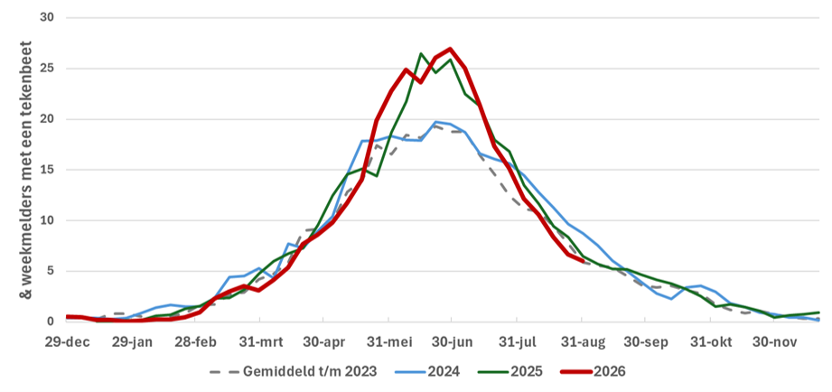

*11 september 2026, bericht van Wageningen University en RIVM*

**Dit jaar werden al vroeg veel tekenbeten gemeld op Tekenradar.nl en de piek lag hoger dan in voorgaande jaren. Het aantal tekenbeten liep na de piek echter ook wat sneller terug dan in voorgaande jaren. Mogelijk is de extreme droogte de oorzaak. Ondanks het lagere aantal tekenbeten is het nu nog steeds belangrijk om het lichaam te checken op tekenbeten na een bezoek aan het groen.**

 

---

De tekenactiviteit liep dit jaar vroeg op tot hoge waarden. Dat bleek uit het aantal mensen dat wekelijks via Tekenradar.nl doorgeeft of ze wel of niet gebeten zijn in de voorgaande week. De piek kwam nog hoger te liggen dan in 2025 en lag daarmee beduidend hoger dan in 2024 en het gemiddelde tot en met 2023 (zie Figuur 1). Nadat de piek in juni bereikt werd liep het aantal tekenbeten wat sneller terug dan in de meeste voorgaande jaren. We vermoeden dat de weersomstandigheden voor de teek tijdens de zeer warme en zeer droge dagen uitdagend waren. Ze lopen dan een groter risico om uit te drogen als ze op zoek gaan naar een gastheer om bloed te drinken. 

<figure className="article-figure">
  
  <figcaption>Figuur 1. Wekelijks meldt een panel via Tekenradar.nl of zij in de afgelopen week wel of niet gebeten zijn. Het percentage is het deel van het panel dat gebeten is, in de grafiek is het gemiddelde over 3 opeenvolgende weken weergegeven (Bron: Tekenradar.nl)</figcaption>
</figure>

Juli was zeer warm en zeer droog. Landelijk gemiddeld viel volgens het KNMI in juli slechts 15 millimeter neerslag (normaal 78 millimeter). In het zuidwesten viel plaatselijk maar 3 millimeter regen. In de eerste helft van augustus was het zeer warm en viel er helemaal geen regen. Vanaf de tweede helft van augustus viel er weer geregeld regen. De huidige regen zal niet leiden tot een plotselinge nieuwe piek in het aantal tekenbeten. Het blijft echter wel belangrijk om na het bezoek aan het groen een tekencheck te doen. Momenteel wordt namelijk nog steeds elke week 1 op de 20 van de wekelijkse tekenbeetmelders door een teek gebeten. Dat er nog steeds mensen gebeten worden zie je ook terug op de tekenbeetmeldingenkaart van Tekenradar.nl.
